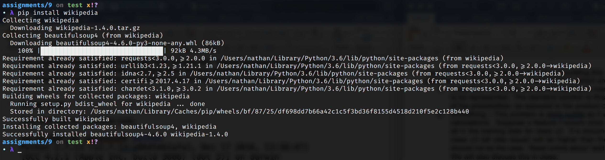

You may work alone or in a pair. If you work in a pair, please make sure you document who you are working with in the comments of the program, and in Google Classroom.

The purpose of this assignment is to explore the concept of "regular expressions" (regex) as well as download/install and use some existing python packages.

In this assignment, you will be using a python package that allows you to programmatically gather information from Wikipedia. You will then use regular expressions to attempt to extract specific information from Wikipedia pages (e.g. a person's date of birth).

# Intro: Using the Wikipedia API

In this part, you will install and tinker with the "Wikipedia API for Python".

## Download and Install Instructions

Open up the command line and install wikipedia using pip (`pip install wikipedia`). If successful you should see something like this (run on macOS):

 \

## Tinkering Instructions

Follow along with the instructions below in the python interpreter (`>>>`).

We will go over this in class, but to use the python interpreter, you will type in `python3` in the terminal and press enter.  You should then see `>>>`, which indicates you are in the interpreter, where you can run any line of a program.

1. At the python interpreter (`>>>`) type `import wikipedia` and hit enter. If no error messages appear then you have successfully installed and imported the Wikipedia API for Python. Congrats!
2. The documentation for the Wikipedia API for Python can be found [here](https://wikipedia.readthedocs.io/en/latest/code.html). This site lists all of the functions that you can execute and some important related classes. Being able to read documentation is an incredibly valuable skill both in the real world and in future classes. It can also be really hard to understand and takes experience to know how to read it well, ask a TA for advice on how to read it if you're having difficulty!
3. Let's try grabbing the contents of a Wikipedia page. If you do a google search for "Wikipedia lane tech", you'll find [this result](https://en.wikipedia.org/wiki/Lane_Tech_College_Prep_High_School). Notice that "Lane_Tech_College_Prep_High_School" is the last part of the URL. This means that "Lane Tech College Prep High School" is the name of a Wikipedia page that you can grab the content of. After importing wikipedia (like we did in step 1) run the below in the interpreter (feel free to copy and paste):

    ```python
    >>> lane_page = wikipedia.WikipediaPage("Lane Tech College Prep High School")
    >>> lane_page.content
    ```

    The `wikipedia.WikipediaPage` function returns an instance of the `WikipediaPage` class. This class has many attributes that you can access including `content`, `categories`, `images`, `sections`, etc. You can read more about the `WikipediaPage` class in the documentation above. The `lane_tech.content`  line should print out all the content of the page.

4. In the last step, we knew the exact name of the Wikipedia page that we wanted. This might not always be the case. We might need to search for a page using the search function (equivalent to doing a search within the Wikipedia site and getting a list of resulting Wikipedia page names). `wikipedia.search` here returns a list of possible page names for our query sorted in terms of how well the page matches our query. To get the top result we can get the name of the page at the first index then use `wikipedia.WikipediaPage` again to get a `WikipediaPage` instance for the page we want. Again run the below code in your interpreter:

    ```python
    >>> results = wikipedia.search("Grace Hopper")
    >>> results[0]
    u'Grace Hopper'
    >>> grace_page = wikipedia.WikipediaPage(results[0])
    >>> grace_page.content
    ```

5. Continue to explore the other attributes available for `WikipediaPage` objects as well as the other functions you can execute. This will require reading the documentation above - linked again [here](https://wikipedia.readthedocs.io/en/latest/code.html).

# Part I: Exploring Regular Expressions

Regular expressions (regex) are special strings used to describe patterns of text. For example, if a website asks you to give it your phone number in this format (XXX) XXX-XXXX, this is a pattern of text (though not a regular expression).

In this part, you'll be learning about regular expressions and how to use them with the python regular expression library (called `re`).

Regular expressions can get very complicated. In this assignment, we'll just scratch the surface of what is possible. If you want to go deeper, feel free to read further [here](https://docs.python.org/2/howto/regex.html). Additionally, [regex101.com](https://regex101.com/) is a fantastic resource for practicing regular expressions with helpful hints on what each component of your expression is doing.

We will cover regular expressions in class. To make sure you understand what we covered in class, see `a8_part_I.py` and complete problems 1, 2 and 3.

# Part II: Using Regular Expressions to Extract Information from Wikipedia Pages

Notice that in `utilities.py` we have provided you with several functions to help with the gathering and cleaning of data from Wikipedia pages. In particular, we are grabbing data from the "infoboxes" that appear on the right side of the pages. Visit [Grace Hopper's Wikipedia page](https://en.wikipedia.org/wiki/Grace_Hopper) if you don't know what we mean -- you'll see a box of structured facts on the right - that's the infobox.

In this part of the assignment, you'll be writing code to extract data from these boxes. In particular, you'll write two different regular expressions, one to get the date of birth from the infobox of anyone with a Wikipedia page and one to get the radius of a planet.

Notice the 2 incomplete patterns (marked by `"REPLACE ME"`) on lines `22` and `38` of `a8_part_II.py`. Your job is to fill in each pattern with a regular expression that extracts the proper information (the rest of the function has been implemented for you).

**VERY IMPORTANT:** The text you see on the Wikipedia page has already been rendered meaning the raw text the api receives will look different from what you see on the page. To properly extract information you'll need to look at the raw text the API returns, **NOT** what the page looks like.

Let's walk through an example of that. Going back to our Grace Hopper example from before (and using the helper functions defined in `utilties.py`):

```python
>>> from utilities import *
>>> infobox_text = get_first_infobox_text(get_page_html("Grace Hopper"))
>>> txt
'Grace HopperHopper in 1984BornGrace Brewster Murray(1906-12-09)December 9, 1906New York City, U.S.DiedJanuary 1, 1992(1992-01-01) (aged\xa085)Arlington County, Virginia, U.S.Resting placeArlington National CemeteryAlma\xa0materVassar College (BA)  Yale University (MS, PhD)Spouse\nVincent Foster Hopper\n\u200b \u200b(m.\xa01930; div.\xa01945)\u200bAwards\nDefense Distinguished Service Medal\nLegion of Merit\nMeritorious Service Medal\nAmerican Campaign Medal\nWorld War II Victory Medal\nNational Defense Service Medal\nArmed Forces Reserve Medal with two Hourglass Devices\nNaval Reserve Medal\nPresidential Medal of Freedom (posthumous)\nMilitary careerAllegiance\xa0United StatesService/branch\xa0United States NavyYears\xa0of service1943–1986Rank Rear admiral (lower half)\nKnown\xa0for\nFLOW-MATIC\nCOBOL\nScientific careerFieldsComputer scienceMathematicsInstitutions\nVassar College\nHarvard University\nEckert–Mauchly Computer Corporation\nRemington Rand\nDigital Equipment Corporation\nThesisNew Types of Irreducibility Criteria\xa0(1934)Doctoral advisorØystein Ore\n\n'
>>> print(txt)
Grace HopperHopper in 1984BornGrace Brewster Murray(1906-12-09)December 9, 1906New York City, U.S.DiedJanuary 1, 1992(1992-01-01) (aged 85)Arlington County, Virginia, U.S.Resting placeArlington National CemeteryAlma materVassar College (BA)  Yale University (MS, PhD)Spouse
Vincent Foster Hopper
​ ​(m. 1930; div. 1945)​Awards
Defense Distinguished Service Medal
Legion of Merit
Meritorious Service Medal
American Campaign Medal
World War II Victory Medal
National Defense Service Medal
Armed Forces Reserve Medal with two Hourglass Devices
Naval Reserve Medal
Presidential Medal of Freedom (posthumous)
Military careerAllegiance United StatesService/branch United States NavyYears of service1943–1986Rank Rear admiral (lower half)
Known for
FLOW-MATIC
COBOL
Scientific careerFieldsComputer scienceMathematicsInstitutions
Vassar College
Harvard University
Eckert–Mauchly Computer Corporation
Remington Rand
Digital Equipment Corporation
ThesisNew Types of Irreducibility Criteria (1934)Doctoral advisorØystein Ore
```

**Note:** check the difference between the text from the API and the text on the page. In the API text you'll see that right after `"Born\n"` you see two different formattings of the birth date - `(1906-12-09)` and `December 9, 1906`. If you go to [Grace Hopper's page](https://en.wikipedia.org/wiki/Grace_Hopper) you'll see that the infobox only shows `December 9, 1906`. For the purposes of this assignment we'd like the `yyyy-mm-dd` format so you'll want to make sure to write your regex for the raw text.

**Note II:** in addition to the difference in characters not the formatting difference between the raw text from the API and using `print` to output it. `print` renders characters like newlines making it harder to tell the regex you'll need to write. If you want to print out raw strings as you develop/debug use `print(repr(some_string))` (the `repr` function raw output).

# Optional

If you finish the two required functions try and write a few more to extract other interesting information! Explore some Wikipedia pages, the infobox in particular offers relatively well structured data which will make your queries a little easier.

# Turning In

Make sure you push to github and your assignment will be graded.  Again, make sure that you have you and your partners name commented on part I and part II.
